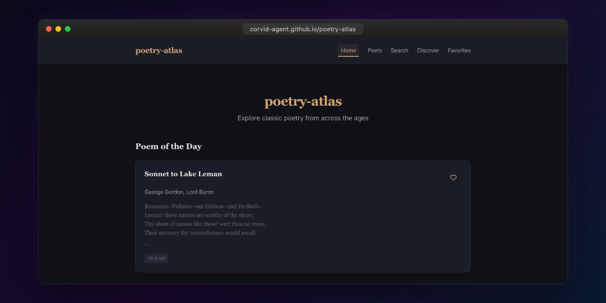

<p align="center"></p>

# Poetry Atlas

Interactive poetry explorer for discovering and reading classic poems, powered by PoetryDB.

**Live:** [corvid-agent.github.io/poetry-atlas](https://corvid-agent.github.io/poetry-atlas/)

## Features

- Browse poems by poet, title, or lines
- Full-text search across the poetry collection
- Random poem discovery
- Poet profiles with statistics and bibliographies
- Favorites collection
- Mobile-optimized reading experience

## Tech Stack

- Angular 21 (standalone components, signals, OnPush)
- PoetryDB API (no API key required)
- TypeScript strict mode
- CSS custom properties with warm accent theme
- Georgia serif for poem display

## Development

```bash
npm install
npm start
npm test
npm run build
```

## License

MIT
